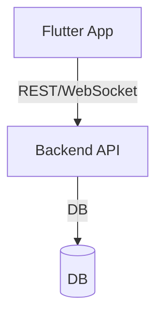

# 🗳️ poll_app

A modern, cross-platform polling app built with **Flutter**. Real-time voting, live results, admin panel, user profile, and more!

## 🚀 Features

- **System theme support** (light/dark mode)
- **Create, delete, edit, archive polls**
- **Draft poll management**
- **Start/end polls and manage poll status**
- **Voting and live results (WebSocket/stream-ready)**
- **Admin panel:** Poll management, statistics
- **User profile:** Participation history and stats
- **Search, filter, sort polls**
- **No mock data, ready for backend integration**

## 🏗️ Architecture



## 🛠️ Tech Stack

| Layer    | Technology                             |
| -------- | -------------------------------------- |
| Frontend | Flutter, Riverpod, go_router, fl_chart |
| Backend  | (Not included, easily integrable)      |
| Auth     | (Firebase Auth or JWT recommended)     |

## 🧭 User Flow

- Splash/Auth → Home (Poll List)
- Poll Detail → Vote
- Live Results
- Create Poll
- Admin Panel
- Profile

## 🏁 Getting Started

1. **Clone the project:**
   ```bash
   git clone <repo-url>
   cd poll_app
   ```
2. **Install dependencies:**
   ```bash
   flutter pub get
   ```
3. **Run:**
   ```bash
   flutter run
   ```
   - Supports Android/iOS/Web/Desktop.

## 🔌 Backend Integration

- All providers and services are mock-free and ready for real backend integration.
- See `lib/providers/polls_provider.dart` and files under `lib/services/` for TODO comments indicating integration points.
- Recommended: Use REST API or WebSocket for poll, vote, and user data.

## 📦 Folder Structure

```
poll_app/
  lib/
    models/         # Data models (Poll, Vote, User, ...)
    providers/      # Riverpod state management
    screens/        # UI screens
    services/       # API/WebSocket services
    main.dart       # Entry point
  ...
```

## 👤 Author & Portfolio

**Alper Doğramacı**  
[GitHub](https://github.com/AlperDog) • [Portfolio](https://github.com/AlperDog/portfolio) • [LinkedIn](https://www.linkedin.com/in/dogramacialper/)

> _This project is the centerpiece of my portfolio. See more at: [AlperDog/portfolio](https://github.com/AlperDog/portfolio)_

## ⭐️ Show Your Support

- Star this repo if you like it!
- [Give feedback or open an issue](https://github.com/AlperDog/poll_app/issues)

## 📄 License

MIT
