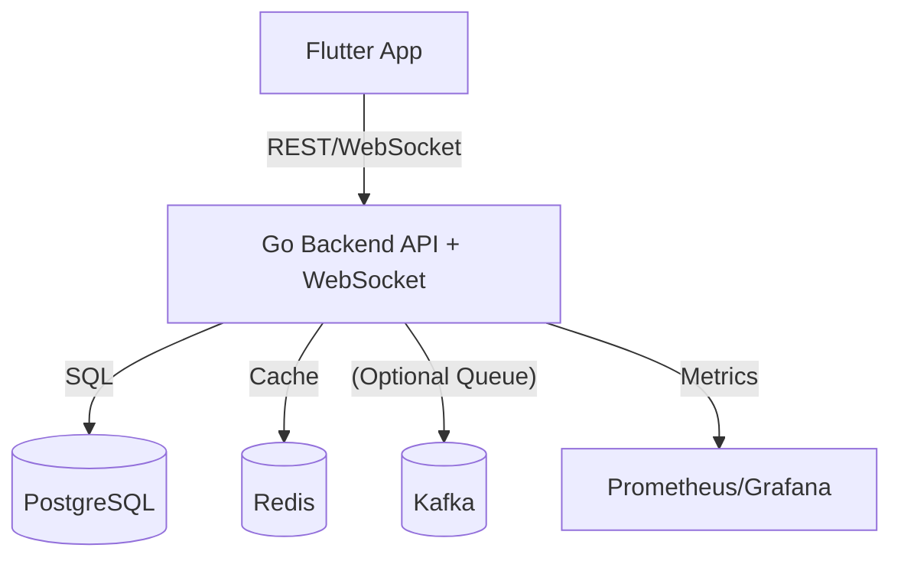
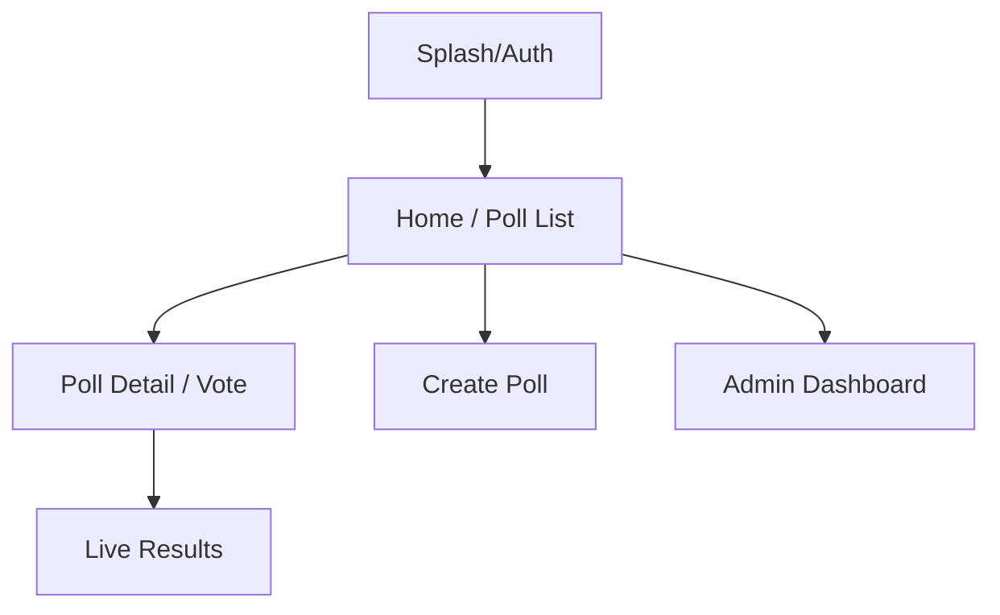

# 🗳️ poll_app

A cross-platform, real-time polling app built with **Flutter** and a modern Go backend. Instantly create, join, and visualize live polls with beautiful charts and WebSocket-powered updates. Designed as a flagship project for my portfolio: [AlperDog/portfolio](https://github.com/AlperDog/portfolio)

---

## 🚀 Features

- **Real-time voting:** Live poll results update instantly via WebSockets
- **Cross-platform:** Runs on Android, iOS, Web, Windows, macOS, and Linux
- **JWT Auth:** Secure login and guest access
- **Beautiful charts:** Live results visualized with bar and pie charts
- **Admin dashboard:** Start/stop polls, monitor participants, reset votes
- **Modern UI:** Clean, responsive, and mobile-first design
- **Scalable backend:** Go (Fiber/Echo), PostgreSQL, Redis, Docker-ready

## 🏗️ Architecture



## 🛠️ Tech Stack

| Layer    | Tech                                   |
| -------- | -------------------------------------- |
| Frontend | Flutter, Riverpod, go_router, fl_chart |
| Backend  | Go (Fiber/Echo), WebSocket, JWT        |
| Database | PostgreSQL, Redis                      |
| Realtime | Native Go WebSocket, (Kafka optional)  |
| DevOps   | Docker, docker-compose, (K8s optional) |
| Auth     | JWT, flutter_secure_storage            |
| Charts   | fl_chart, charts_flutter               |

## 🧭 User Flow



## ✨ Key Features

- **Live Polls:** Create, join, and vote in real time
- **Instant Results:** See live charts update as votes come in
- **Admin Tools:** Start/stop polls, reset votes, monitor users
- **Secure Auth:** JWT-based login and guest access
- **Modern Flutter UI:** Responsive, beautiful, and accessible
- **Scalable Backend:** Go, PostgreSQL, Redis, Docker

## 🏁 Getting Started

### 1. Clone the repo

```bash
git clone https://github.com/AlperDog/poll_app.git
cd poll_app
```

### 2. Install dependencies

```bash
flutter pub get
```

### 3. Run the app

- **Mobile/Web/Desktop:**
  ```bash
  flutter run
  ```
- **Choose your device (Android/iOS/Web/Windows/macOS/Linux)**

### 4. (Optional) Run backend

- See `/backend` (coming soon) for Go API setup

## 🧪 Demo

- Try the real-time voting and see charts update instantly
- Use the admin dashboard to manage polls
- Test on any device or browser

## 📦 Folder Structure

```
poll_app/
  lib/
    models/         # Data models (Poll, Vote, User, etc.)
    providers/      # Riverpod state management
    screens/        # UI screens
    services/       # WebSocket, API, etc.
    main.dart       # App entry point
  android/ ios/ web/ windows/ macos/ linux/ # Platform folders
  pubspec.yaml      # Flutter dependencies
  README.md         # This file
```

## 🧑‍💻 Author & Portfolio

**Alper Doğramacı**  
[GitHub](https://github.com/AlperDog) • [Portfolio](https://github.com/AlperDog/portfolio) • [LinkedIn](https://www.linkedin.com/in/dogramacialper/)

> _This project is the centerpiece of my portfolio. See more at [AlperDog/portfolio](https://github.com/AlperDog/portfolio)_

## ⭐️ Show your support

- Star this repo if you like it!
- [Share your feedback or open an issue](https://github.com/AlperDog/poll_app/issues)

## 📄 License

MIT
